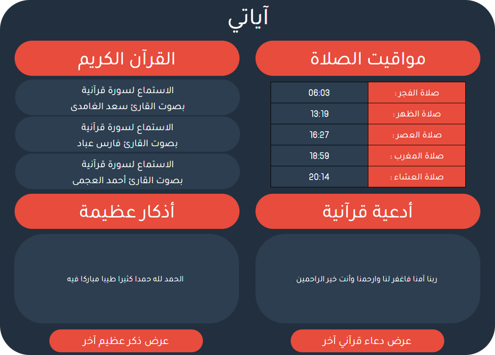
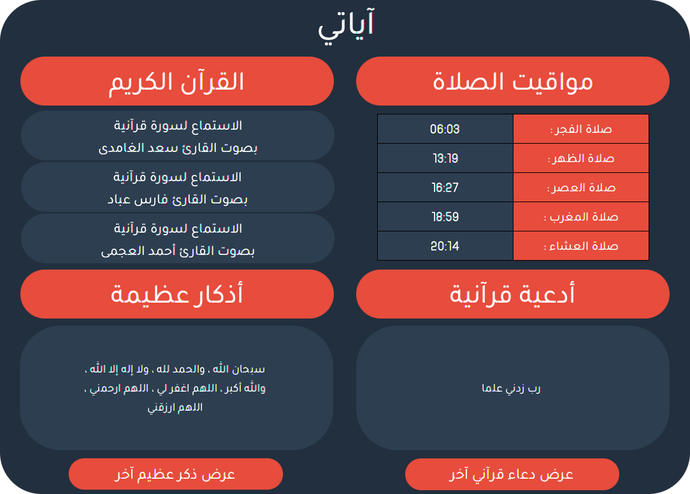

# Ayaaty
>A JAVA desktop application to listen to quran, show quranic supplications and Dhikr


## Built With
* [JavaFX](https://openjfx.io/)
* [Jsoup](https://jsoup.org/)

## Prerequisites

- Install the fonts, which are located in ```/fonts/```

## Screenshots






## Contributing

Contributions are what make the open source community such an amazing place to be learn, inspire, and create. Any contributions you make are **greatly appreciated**.

1. Fork the Project
2. Create your Feature Branch (`git checkout -b feature/AmazingFeature`)
3. Commit your Changes (`git commit -m 'Add some AmazingFeature'`)
4. Push to the Branch (`git push origin feature/AmazingFeature`)
5. Open a Pull Request

## License
[MIT License](https://choosealicense.com/licenses/mit/)
## Contact
- Yassine Lafryhi - [@YassineLafryhi](https://twitter.com/YassineLafryhi) - [y.lafryhi@gmail.com](mailto:y.lafryhi@gmail.com)
- Project Link : [https://github.com/Yassine-Lafryhi/Ayaaty](https://github.com/Yassine-Lafryhi/Ayaaty)
